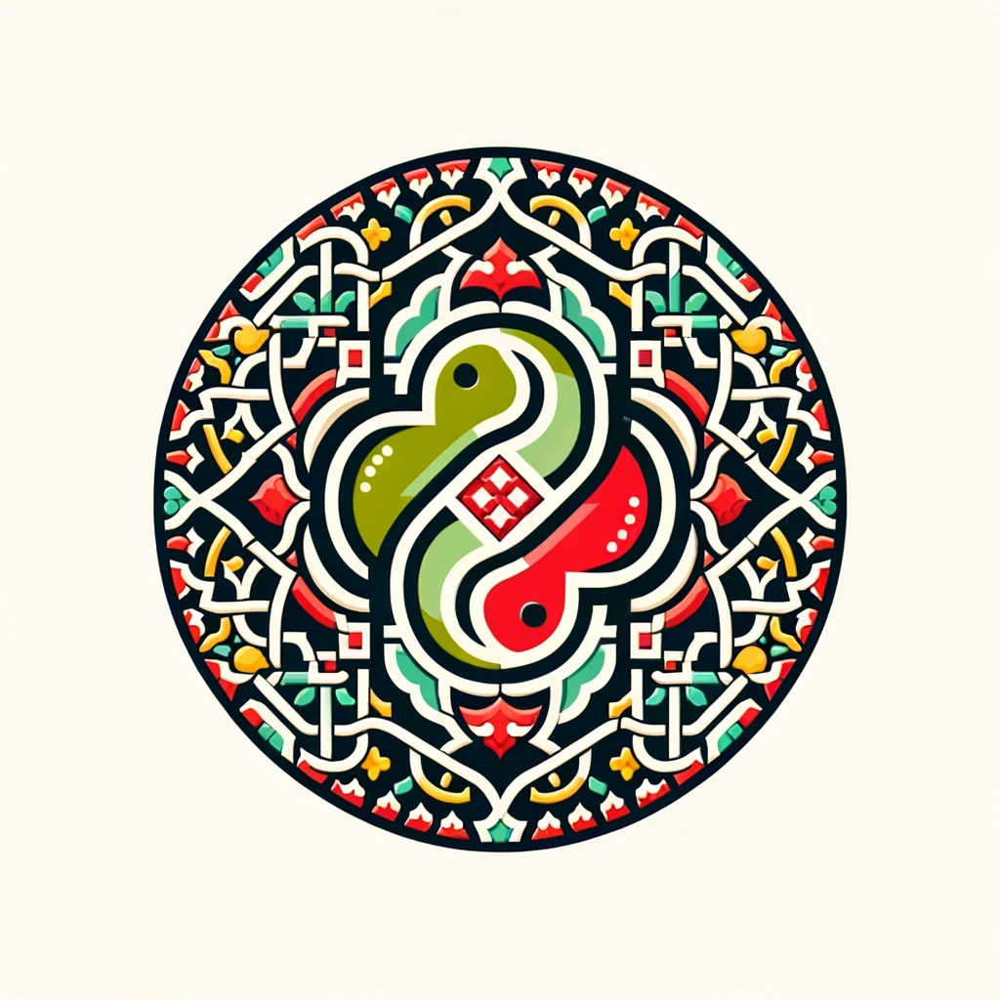

# Zellij Framework




Welcome to Zellij, an asynchronous Python web framework designed with the heart and innovation of Morocco. Inspired by the rich tradition and artistic heritage of Morocco, Zellij aims to blend the robustness of Django with the simplicity and performance of FastAPI, adopting an MVC architecture. Our goal is to empower developers with a tool that simplifies web development without compromising on efficiency or flexibility. Proudly made in Morocco, Zellij is for developers who appreciate artistry in code.

## Features

- **Asynchronous Core**: Leveraging Starlette for non-blocking request handling.
- **ORM Support**: Seamless integration with SQLAlchemy, providing async support and compatibility with a wide range of databases.
- **MVC Architecture**: Emphasizing clear separation of concerns through Models, Views, and Controllers.
- **CLI Tools**: Simplify common tasks like server startup and database migrations with intuitive CLI commands.
- **Security Focused**: Secure authentication, session management, and advanced password hashing.
- **Templating with Jinja2**: For dynamic content rendering.
- **Testing Support**: Encourages test-driven development with pytest.

## Getting Started

Zellij is easy to install and set up:

```bash
pip install zellij-framework
```

This command installs Zellij along with all necessary dependencies, letting you focus on building your application.

## Create a New Project
To create a new Zellij project:

```bash
zellij startproject your_project_name
```

Navigate into your project directory to start development.

## Documentation
We area relatively new framework, we will be working extensively on the documentation, but we urge our contributors to pitch in.

## Contributing

Zellij thrives on contributions from the global developer community. Whether you're in Morocco or anywhere else in the world, your contributions are welcome. Here's how you can contribute:

1. **Fork the repository** and clone it locally.
2. **Create a branch** for your contributions.
3. **Commit your changes** and push them to your fork.
4. **Submit a pull request** with a clear description of your improvements or new features.

See our [Contribution Guidelines](CONTRIBUTING.md) for detailed instructions.

## License

Zellij is open-source software licensed under the MIT License. See the [LICENSE](LICENSE) file for more details.

## Made with Pride in Morocco

Zellij is not just a web framework; it's a testament to Moroccan innovation and creativity in the digital realm. We aim to contribute to the global software community from the heart of Morocco. Thank you to all our contributors and users around the world.

